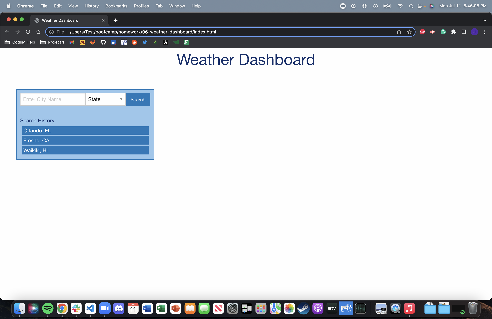
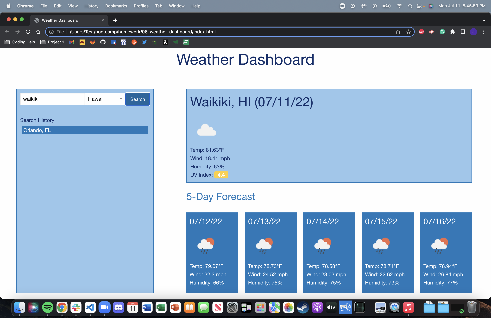

# weather-dashboard

In this challenge we were to create a Weather Dashboard using 3rd party API's

When you search city and state you will be given the current and future weather conditions

This is displayed with icons and weather conditions consisting of temperature, humidity, wind speed, and UV index

The UV Index includes color coordination for favorable, moderate, and severe

When you click on a city in the search history it will show you the weather for that city

While working on this assignment in VS code it worked perfectly, but when I tried running the published page on my personal computer it gave me an error saying that I was requesting an insecure resource in openweathermap.org 

https://github.com/jystyn/weather-dashboard
https://jystyn.github.io/weather-dashboard/

